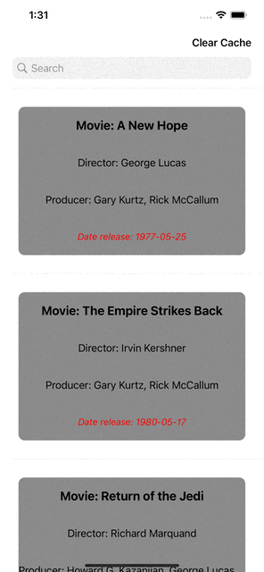

<h1 align="center">Star wars</h1>

# Stack of technologies

* Swift
* UIKit
* MVVM
* CoreData

## This app has several features:
* List of Movies
* Search bar by movies 
* List of persons for every movie
* Info about homeworld of every person
* Caching data

# Overview

<table>
    <thead>
        <tr>
            <th>Main Screen</th>
            <th>Page Control</th>
        </tr>
    </thead>
    <tbody>
        <tr>
            <td>
                
            </td>
            <td>
                
            </td>
        </tr>
    </tbody>
</table>

